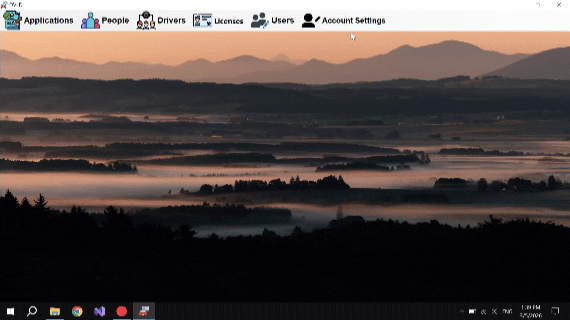
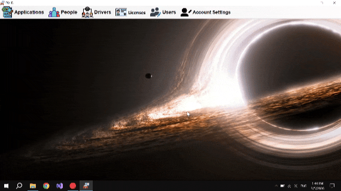
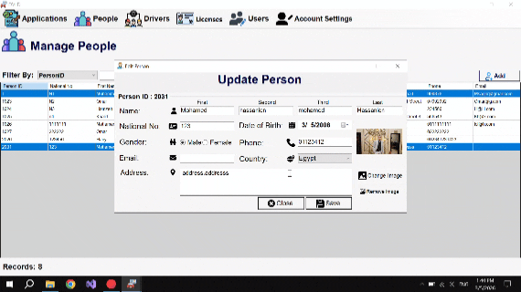
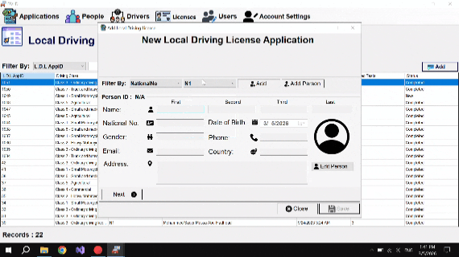
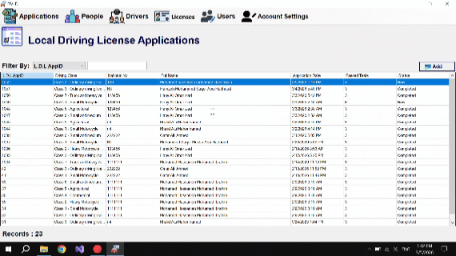
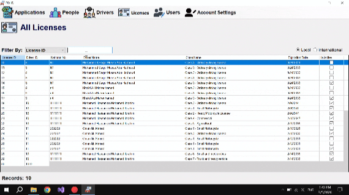

# 🚗 DVLD - Driver & Vehicle Licensing Department

A comprehensive desktop application for managing driving licenses, vehicles, and related services. Built using **.NET Framework (WinForms)** and **SQL Server**
---
## ⏱️ Project Timeline
- **Core Development:** Completed in **21 Days** (Database Design, DAL, BL, and Basic UI).
- **Maintenance & Refactoring:** **18 Days** dedicated to code cleaning, bug fixing, and adding user-friendly shortcuts.

---
## What I learned form this project
* There is Always is better way to wirte the code (Every time i imporve in the program, I find a better way).
* Improtance Of Software Tester(Sometimes that not a little times when i move to the next step i found a bug in a last session).

---

  
## 🌟 Features
* **Manage People:** Add, Edit, Delete, and List people with filtering.
* **Manage Users:** System users with role-based permissions and secure login system.
* **License Operations:** Issue, Renew, Replace (Damaged/Lost), Detain, and Release.
* **Tests Management:** Schedule Vision, Written, and Street tests.
* **Application Management:** Local and International license applications.
* **Driver History:** Quick access to all licenses and test history for any driver.
---

## Overview
#### Change Background

#### Add new person

#### Add new user

#### Add new LDLA

#### Take test

#### Issue Driving License

#### International License

  
## 🛠️ Built With
- **Language:** C#
- **Framework:** .NET Framework (WinForms)
- **Database:** Microsoft SQL Server
- **Architecture:** Clean 3-Layer Architecture (Data Access, Business, and Presentation Layers).
---
  
## 🚀 Key Learning Outcomes
During this project, I improved my skills in:
- Designing complex **Relational Databases**.
- Implementing **Layered Architecture** to separate concerns.
- Handling **Events and Delegates** for cross-form communication.
- Mastering **ADO.NET** for efficient data operations.
- Writing **Clean Code** through continuous refactoring.
---

## What Should be dovelped next (In my point of view)
* The Overall Orginzation of the folders, Class Should be more Separeted (not in small or one file like i did)
* The Cocepet of Compsition, Inhertance and will use of OOP Concepts didn't really implemented in a good way in the project
  this becuase the way i tried to make this app is by fix the current problems i face in the app then try to improve the code.
